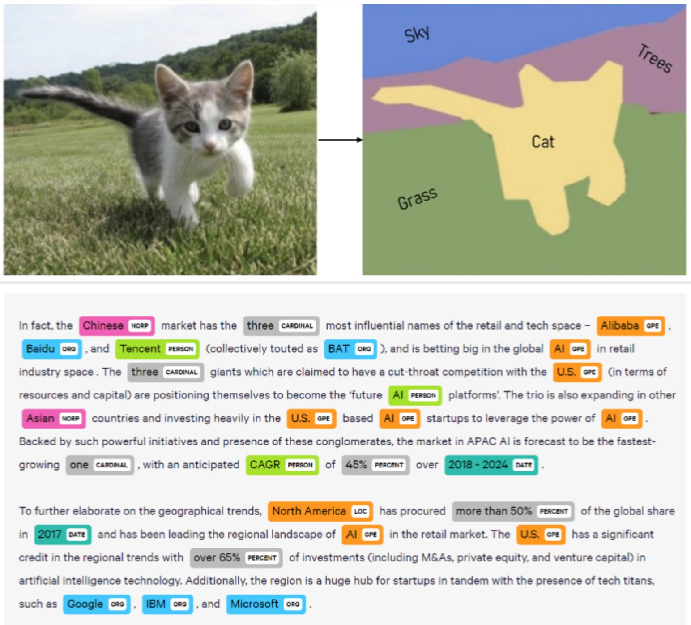

# Semantic Segmentation w/ synthetic data

---
## Table of contents
- [1. Introduction](#introduction)
- [2. Repo structure](#repo-structure)
- [3. Implementation details](#implementation-details)
- [4. Monitoring integration](#monitoring-integration)
- [5. Quickstart code](#quickstart-code)
- [6. License](#license)
---

## Introduction
Image segmentation is one of the most popular computer vision tasks, where every pixel is tagged as a specific label; it is the equivalent formulation of Named Entity Recognition (NER) tasks in natural language procesing:




## Repo structure

Since all scripts do have the same requirements and source folder, a unified structure for all of them is used, as illustrated below:


<details>
<summary>
Click here to find out!
</summary>

    ├── config                                 # Configuration files
    │   ├── experiment_config.yaml             # Configuration file for training and monitoring
    │   ├── single_cpu_config.yaml             # Configuration file for single-cpu thread
    │   ├── multi_cpu_config.yaml              # Configuration file for multi-cpu thread
    │   ├── single_gpu_config.yaml             # Configuration file for single-gpu thread
    │   └── multi_gpu_config.yaml              # Configuration file for multi-gpu thread
    |
    ├── input                                  # Dataset (generated during running)
    │   ├──train                               # Train split
    │   │  ├──images                           # Rendered image of a face
    │   │  │  ├──{frame_id_1}.png        
    │   │  │  ├──...
    │   │  │  └──{frame_id_n}.png        
    │   │  └──annotations                      # Segmentation image, where each pixel has an integer value
    │   │     ├──{frame_id_1}_seg.png        
    │   │     ├──...
    │   │     └──{frame_id_n}_seg.png        
    │   └──val                                 # Train split
    │      ├──images                           # Rendered image of a face
    │      │  ├──{frame_id_1}.png        
    │      │  ├──...
    │      │  └──{frame_id_m}.png        
    │      └──annotations                      # Segmentation image, where each pixel has an integer value
    │         ├──{frame_id_1}_seg.png        
    │         ├──...
    │         └──{frame_id_m}_seg.png     
    |
    ├── src                                    # Main methods to build scripts code
    │   ├── callbacks.py                       # Contains W&B logging
    │   ├── dataset.py                         # Method that structures and transforms data
    │   ├── fitter.py                          # Training, validation and storing loop wrapper
    │   ├── loss.py                            # Custom function to meet our needs during training
    │   ├── model.py                           # Core script containing the architecture of the model
    │   ├── setup.py                           # Helper methods to shorten main script length and make it more readable
    │   └── utils.py                           # Helper methods to control reproducibility
    │
    ├── requirements.txt                       # Libraries to be used and their versions
    └── train.py                               # Script to run model training
</details>


## Implementation details

* The chosen model architecture for this project is [SegFormer pretrained backbone :hugs:](https://huggingface.co/docs/transformers/model_doc/segformer) from [NVIDIA Research project ](https://github.com/NVlabs/SegFormer). 
* Loss function is a generalisation of the widely known Jaccard loss, based on [this paper](https://www.scitepress.org/Papers/2021/103040/103040.pdf).
* Training loop has been adapted to [accelerate :hugs:](https://github.com/huggingface/accelerate) library to be able to adapt our environment to our computing resources.


## Monitoring integration
This experiment has been integrated with Weights and Biases to track all metrics, hyperparameters, callbacks and GPU performance. You only need to adapt the parameters in the `experiment_config.yaml` configuration file to keep track of the model training and evaluation.

## Quickstart code
In the config section, you will find some template configuration files to get up to speed with `accelerate`. As an example, the following terminal command will run the training script:

```bash
accelerate launch --config_file ./config/single_gpu_config.yaml train.py
```


## License
Released under [MIT](/LICENSE) by [@hedrergudene](https://github.com/hedrergudene).